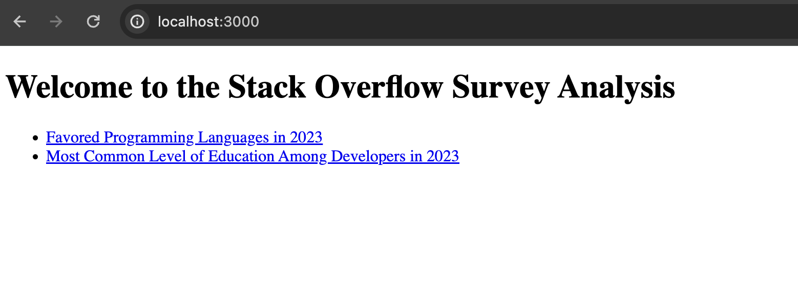
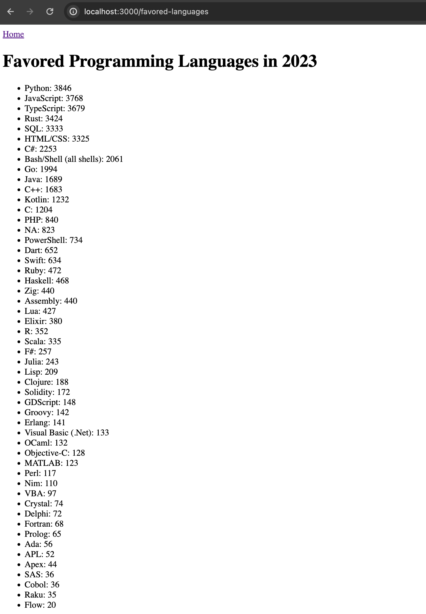

<h1>Database Advanced Data Techniques</h1>
<h2>Final report</h2>

<div style="text-align: right"> Course <b>CM3010</b></div>
<div style="text-align: right"> Final report</div>
<div style="text-align: right"> Student <b>Anvar Nurmatov</b></div>
<div style="text-align: right"> January 06, 2024</div>

<h2>Contents:</h2>

- [Introduction](#introduction)
- [Dataset Overview](#dataset-overview)
- [Exploratory Data Analysis (EDA)](#exploratory-data-analysis-eda)
  - [Key Observations from EDA](#key-observations-from-eda)
- [Defining Research Questions](#defining-research-questions)
- [Data Modeling](#data-modeling)
- [Database Implementation](#database-implementation)
  - [Database Setup Script](#database-setup-script)
- [Data Cleaning and Preprocessing](#data-cleaning-and-preprocessing)
  - [Data Normalization](#data-normalization)
  - [Preprocessing Script](#preprocessing-script)
- [Data Analysis and Findings](#data-analysis-and-findings)
  - [Most Favored Programming Languages in 2023](#most-favored-programming-languages-in-2023)
  - [Most Common Level of Education Among Developers in 2023](#most-common-level-of-education-among-developers-in-2023)
  - [Implications and Conclusions](#implications-and-conclusions)
- [Web Application Development](#web-application-development)
  - [Overview](#overview)
  - [Back-end Development](#back-end-development)
  - [Front-end Development](#front-end-development)
  - [Features](#features)
  - [Application Deployment](#application-deployment)
  - [Conclusion](#conclusion)
- [Conclusion](#conclusion-1)
- [References](#references)
  - [Legal Notice Regarding the Use of Survey Data](#legal-notice-regarding-the-use-of-survey-data)
- [Appendices](#appendices)
  - [Appendix A: SQL Scripts for Database Creation and Data Import](#appendix-a-sql-scripts-for-database-creation-and-data-import)
    - [A.1 Database Creation Script (database.py)](#a1-database-creation-script-databasepy)
    - [A.2 Data Import and Normalization Script (preprocess.py)](#a2-data-import-and-normalization-script-preprocesspy)
  - [Appendix B: Node.js Server Code](#appendix-b-nodejs-server-code)
    - [Server Setup and Dependencies](#server-setup-and-dependencies)
    - [Core Functionalities](#core-functionalities)
    - [Code Snippets](#code-snippets)
  - [Appendix C: Instructions for Setting Up and Running the Application](#appendix-c-instructions-for-setting-up-and-running-the-application)
    - [Prerequisites](#prerequisites)
    - [Step 1: Clone the Repository](#step-1-clone-the-repository)
    - [Step 2: Set Up the Database](#step-2-set-up-the-database)
    - [Step 3: Populate the Database](#step-3-populate-the-database)
    - [Step 4: Install Dependencies](#step-4-install-dependencies)
    - [Step 5: Configure Database Connection](#step-5-configure-database-connection)
    - [Step 6: Start the Node.js Server](#step-6-start-the-nodejs-server)
    - [Step 7: Access the Web Application](#step-7-access-the-web-application)
    - [Step 8: Explore the Application](#step-8-explore-the-application)
  - [Appendix D: SQL Query Results](#appendix-d-sql-query-results)
    - [D.1 Most Favored Programming Languages in 2023](#d1-most-favored-programming-languages-in-2023)
    - [D.2 Most Common Level of Education Among Developers in 2023](#d2-most-common-level-of-education-among-developers-in-2023)

## Introduction
This report delves into the 2023 Stack Overflow Developer Survey, aiming to uncover trends and preferences within the global developer community. By analyzing this comprehensive dataset [Stack Overflow Developer Survey 2023](#references), we seek to gain insights into the technologies, practices, and sentiments that shape the landscape of software development today.

## Dataset Overview
The Stack Overflow Developer Survey 2023 is a comprehensive collection of responses from thousands of developers worldwide. It covers a wide range of topics from programming languages, frameworks, and tools to career satisfaction and development practices. This dataset is an invaluable resource for understanding current trends in the tech industry.


## Exploratory Data Analysis (EDA)

During the initial phase of exploratory data analysis, we examined a subset of the Stack Overflow Developer Survey 2023 to identify patterns and gain preliminary insights. This analysis focused on understanding the distribution and trends of various attributes, such as programming languages popularity, respondents' age distribution, and education levels.

Below is a snapshot of the data we analyzed, formatted as a table for clarity:

| ResponseId | Age   | EdLevel                              | LanguageWantToWorkWith  |
|------------|-------|--------------------------------------|-------------------------|
| 1          | 25-34 | Bachelor’s degree (B.A., B.S., ...)  | JavaScript; HTML/CSS    |
| 2          | 18-24 | Some college/university study        | Python; Rust            |
| 3          | 35-44 | Master’s degree (M.A., M.S., ...)    | Go; TypeScript          |
| ...        | ...   | ...                                  | ...                     |

*Sample data extracted from the Stack Overflow Developer Survey 2023.*

### Key Observations from EDA

1. **Programming Language Popularity**: Early analysis suggests a strong preference for web-based languages such as JavaScript and Python. Further investigation will determine the most favored programming languages in 2023.

2. **Age Distribution**: There is a diverse age range among respondents, with a notable concentration in the 25-34 age bracket. This may reflect the demographics of active developers in the industry.

3. **Educational Background**: Preliminary data shows a wide range of educational backgrounds, with a significant number of respondents holding a Bachelor's degree. We will analyze how educational levels correlate with other factors such as language preference.

The EDA provided valuable direction for our research questions and helped to tailor our subsequent data modeling and analysis efforts. It is evident from the early stages that the survey data is rich with insights that can illuminate the current state of the developer community and the tech industry at large.


## Defining Research Questions
Based on our objectives and the data available in the Stack Overflow Developer Survey 2023, we have identified two key research questions:

1. **What are the most favored programming languages in 2023?**
   - This question aims to identify the programming languages that are most popular among developers, providing insights into current technology trends in the software development industry.

2. **What is the most common level of education among developers in 2023?**
   - This question seeks to understand the educational background of the developer community, which can be indicative of the industry's educational diversity and requirements.


## Data Modeling

The data modeling for the Stack Overflow Developer Survey 2023 was adapted to a revised Entity-Relationship Diagram (ERD) that reflects the updated database structure. This ERD serves as a comprehensive blueprint for our database, as detailed in [Appendix A](#appendix-a-sql-scripts-for-database-creation-and-data-import). The key components of the ERD, in alignment with the new database schema, include:

- **Entities**: Our ERD includes the entities `Education_Levels`, `Respondents`, and `Languages`. These entities correspond to the main data points we are analyzing from the survey:
  - `Education_Levels` contains the various educational qualifications reported by the survey respondents.
  - `Respondents` records individual survey participants, their identifiers, ages, and direct association with an education level.
  - `Languages` lists the programming languages that respondents are interested in working with.

- **Relationships**:
  - `Respondents` are directly linked to `Education_Levels`, establishing a one-to-one relationship where each respondent reports one education level, indicated by the foreign key `education_level_id` in the `Respondents` table.
  - `Respondents_Preferred_Languages` is an associative table that facilitates a many-to-many relationship between `Respondents` and `Languages`, showing the programming languages that are preferred by each respondent.

- **Normalization**:
  - The ERD reflects a normalized structure that aims to reduce data redundancy and improve the integrity of our database. This design allows for efficient data storage and retrieval for analysis purposes.

Below is the visual representation of the ERD for our database:

<p align="center">
  
</p>

This visual ERD illustrates the relationships between `Respondents`, `Education_Levels`, and `Languages`, with the associative tables clearly indicating the connections that support our research questions. The diagram serves as a guide for understanding the logical structure of our database and informs our data cleaning, preprocessing, and subsequent analysis.


## Database Implementation

The database was implemented using MySQL, a widely used relational database management system. The implementation process involved the execution of SQL scripts to create a structured repository for the Stack Overflow Developer Survey 2023 data.

### Database Setup Script

In addition to data normalization and preprocessing, a separate script, `data_preparation_scripts/database.py`, was created to automate the setup of the database structure. This script plays a crucial role in establishing the foundational database schema onto which the survey data is loaded. The key functions of this script include:

- **Database Creation**: Automatically creates the `stackoverflow_survey` database, ensuring a clean environment for data import.
- **Table Definition and Creation**: Defines and creates tables in accordance with the normalized database schema. This includes tables for respondents, education levels, languages, and their associative relationships.
- **Execution and Committing**: The script executes SQL statements to construct the database and its tables, committing each change to ensure the database structure is correctly set up.

To recreate the database on a different machine, one simply needs to run the `database.py` script. This script is designed to be idempotent, meaning it can be run multiple times without causing errors or unintended effects, as it first checks for the existence of the database and drops it if it exists before creating a new one.

This approach ensures that the database setup process is easily replicable, making it convenient for any reviewer or user to initialize the database on their local system for analysis or review purposes.


## Data Cleaning and Preprocessing

The preprocessing of the Stack Overflow Developer Survey 2023 data was an essential step to ensure the data was organized efficiently and was ready for analysis. The focus was on structuring the database to minimize redundancy and to improve data integrity through a process known as data normalization.

### Data Normalization

Our approach to data normalization involved several critical steps:

1. **Entity Separation**: We constructed distinct tables for different types of data. The `respondents` table contains individual survey responses, `education_levels` captures the various educational qualifications, and `languages` holds programming languages.

2. **Elimination of Redundancy**: Instead of repeatedly storing education levels and programming languages for each respondent within the `respondents` table, we created separate tables and established relationships through foreign keys. This method prevents data duplication and simplifies updates to the data.

3. **Referential Integrity**: By using foreign keys, we ensured referential integrity within our database. This means that relationships between tables are consistent, and the database structure accurately reflects the real-world constructs of the survey data.

### Preprocessing Script

The `data_preparation_scripts/preprocess.py` script was carefully crafted to populate our normalized database structure with the survey data:

- **Data Extraction**: The script reads the survey CSV file and extracts the necessary information, such as respondent IDs, ages, education levels, and preferred programming languages.

- **Data Transformation**: Raw data from the CSV file is transformed to fit the database schema. This includes mapping education levels to their corresponding records in the `education_levels` table and doing the same for programming languages with the `languages` table.

- **Database Population**: The script populates the database by inserting data into the correct tables. It ensures that each respondent is associated with their education level and preferred programming languages, maintaining the integrity of the relationships defined in our schema.

This careful preprocessing is crucial for facilitating effective data analysis and ensuring that the database supports complex queries without compromising performance or data accuracy.


## Data Analysis and Findings

In this section, we present the findings from the data analysis conducted on the Stack Overflow Developer Survey 2023. Our analysis aims to answer the two research questions defined earlier in the report.

### Most Favored Programming Languages in 2023

To determine the most popular programming languages among developers this year, we performed a query on the database that counts the number of times each language was mentioned as preferred. The following SQL query was executed against the `respondents_preferred_languages` and `languages` tables:

```sql
SELECT l.name AS `language`, COUNT(*) AS `count`
FROM respondents_preferred_languages rpl
INNER JOIN languages l ON l.id = rpl.language_id
GROUP BY l.name
ORDER BY `count` DESC;
```
This query provides us with a list of programming languages ranked by their popularity. The most favored language is the one with the highest count, indicating that a large number of developers are interested in working with it. The results from this query can inform educators, companies, and developers about current trends in programming language demand.

The results from our SQL query showed that Python, JavaScript, and TypeScript are the top three programming languages favored by developers in 2023, with Python leading the pack. The popularity of Python could be attributed to its versatile use in emerging fields such as data science, machine learning, and AI, as well as its reputation for having a gentle learning curve. JavaScript and TypeScript's popularity underscores the ongoing importance of web development, with TypeScript gaining traction for its enhancements to JavaScript's type system.

Rust's high ranking reflects the growing appreciation for its performance and safety guarantees, suggesting a keen interest in systems programming. SQL and HTML/CSS are foundational technologies for database management and web development, respectively, which explains their continued strong presence.

The diversity of languages and their use cases illustrate a broad landscape of programming preferences, with developers likely choosing languages based on project requirements, personal preference, and job market demands.

### Most Common Level of Education Among Developers in 2023

Understanding the educational background of developers can provide insights into the qualifications prevalent in the tech industry. To explore this aspect, we utilized the following SQL query which aggregates the count of developers by their reported education level:

```sql
SELECT el.name AS `Education Level`, COUNT(*) AS `count`
FROM respondents r
INNER JOIN education_levels el ON el.id = r.education_level_id
GROUP BY el.name
ORDER BY `count` DESC;
```
The outcome of this query reveals the education levels that are most common among the survey respondents, providing a snapshot of the formal education that developers have completed. Such information could be valuable for hiring managers, policy-makers in education, and prospective students making career planning decisions.

The most common level of education among developers is a Bachelor’s degree, followed by a Master’s degree, and some college/university study without earning a degree. This distribution suggests that while higher education is prevalent in the field, there is a significant portion of the developer population who may be self-taught or have pursued alternative education paths such as coding bootcamps or online courses.

The presence of developers with only secondary education or a professional degree indicates that the tech industry is accommodating to individuals with a wide range of educational backgrounds. The data underscores the tech industry's focus on skills and practical experience over formal education, which can be seen as an encouraging sign for inclusivity and diversity in educational backgrounds within the field.

### Implications and Conclusions

The analysis of favored programming languages suggests that the industry continues to value a mix of established and modern languages, highlighting the importance of versatility in a developer's skill set. For educators and learners, this data emphasizes the need to focus on both the fundamentals of web development and the understanding of modern, scalable, and secure programming practices.

The educational background findings highlight a significant representation of developers with formal education, while also illustrating the tech industry's flexibility and openness to non-traditional educational paths. For hiring practices, this may suggest a shift towards skill-based assessments and a recognition of the value of practical experience and self-directed learning.

In conclusion, the Stack Overflow Developer Survey 2023 provides valuable insights into the evolving landscape of the developer community. It shows an industry in flux, adaptable to new technologies and varied educational experiences, and underscores the dynamic nature of software development as a field of expertise.

The detailed results of the SQL queries are documented in [Appendix D](#appendix-d-sql-query-results), offering a granular view of the data that informed these conclusions.


## Web Application Development

### Overview
The web application was designed to provide a straightforward and interactive way to explore the Stack Overflow Developer Survey data. It was built using Node.js and Express, prioritizing simplicity and functionality. 

### Back-end Development
The back-end of the application was developed using Node.js and Express. It includes several routes to handle requests for different types of survey data. The application connects to the MySQL database, executing SQL queries based on user requests and returning the results. 

### Front-end Development
For the front-end, simple templating was used, employing Express's integrated template engine, EJS (Embedded JavaScript). This approach allowed for dynamically generating HTML pages based on the data retrieved from the back-end. The user interface includes basic forms and tables to facilitate data querying and display the results in a readable format.

**Main Page**

Here is a screenshot of the main page of the application:

<p align="center">
  
</p>

This page provides an introduction and navigation to the different sections of the application, ensuring a user-friendly experience.

**Programming Languages Page**

Here is a screenshot of the first report page:
<p align="center">
  
</p>

This report page displays the analysis of the most favored programming languages in 2023, providing an interactive way for users to explore this aspect of the survey data.

**Educational Background Page**

Here is a screenshot of the second report page:
<p align="center">
  
</p>
This page offers insights into the most common level of education among developers in 2023, visually presenting the findings from the survey data.

### Features
- **Querying Programming Languages**: Users can view statistics about the most popular programming languages in 2023.
- **Querying Educational Background**: The application allows users to explore the distribution of educational levels among developers.

### Application Deployment
The application is set up to run locally for demonstration purposes. Instructions for setting up and running the application are included in [Appendix C](#appendix-c-instructions-for-setting-up-and-running-the-application).

### Conclusion
This simple web application serves as a practical tool for exploring the Stack Overflow Developer Survey data, demonstrating the potential of Node.js and Express in building effective web solutions with minimal complexity.


## Conclusion
This report provides valuable insights into the preferences and trends within the global developer community. Key findings highlight the importance of technology choice on job satisfaction and the evolving nature of work environments. Future research could explore longitudinal changes in these trends and delve deeper into the causative factors behind these observations.


## References
1. Stack Overflow Developer Survey 2023: [https://insights.stackoverflow.com/survey](https://insights.stackoverflow.com/survey)
2. Node.js Documentation: [https://nodejs.org/en/docs/](https://nodejs.org/en/docs/)
3. Express.js Documentation: [http://expressjs.com/](http://expressjs.com/)
4. EJS Documentation: [https://ejs.co/](https://ejs.co/)

### Legal Notice Regarding the Use of Survey Data
The dataset used in this project, The Public 2023 Stack Overflow Developer Survey Results, is available under the Open Database License (ODbL): http://opendatacommons.org/licenses/odbl/1.0/. Any rights in individual contents of the database are licensed under the Database Contents License: http://opendatacommons.org/licenses/dbcl/1.0/.

In compliance with the ODbL, this project is free to share, adapt, and create derivative works from The Public 2023 Stack Overflow Developer Survey Results, provided that proper attribution is given to Stack Overflow, the database remains open (if redistributed), and any adapted database is shared under the same ODbL license.


## Appendices
### Appendix A: SQL Scripts for Database Creation and Data Import

#### A.1 Database Creation Script (database.py)

This script is used to set up the database structure for importing the Stack Overflow Developer Survey data.

```python
# database.py
import mysql.connector

# Database connection details
HOST = 'localhost'
USER = 'root'
DB_NAME = 'stackoverflow_survey'

# Establish database connection
conn = mysql.connector.connect(host=HOST, user=USER)
cursor = conn.cursor()

# Create database and tables
cursor.execute(f"DROP DATABASE IF EXISTS {DB_NAME};")
cursor.execute(f"CREATE DATABASE {DB_NAME};")
conn.commit()
conn.database = DB_NAME

create_tables_sql = """
CREATE TABLE education_levels (
    id INT AUTO_INCREMENT PRIMARY KEY,
    name VARCHAR(255) UNIQUE
);

CREATE TABLE respondents (
    id INT AUTO_INCREMENT PRIMARY KEY,
    response_id VARCHAR(255),
    age VARCHAR(255),
    education_level_id INT NOT NULL,
    FOREIGN KEY (education_level_id) REFERENCES education_levels(id)
);

CREATE TABLE languages (
    id INT AUTO_INCREMENT PRIMARY KEY,
    name VARCHAR(255) UNIQUE
);

CREATE TABLE respondents_preferred_languages (
    respondent_id INT,
    language_id INT,
    FOREIGN KEY (respondent_id) REFERENCES respondents(id),
    FOREIGN KEY (language_id) REFERENCES languages(id)
);
"""

for statement in create_tables_sql.split(';'):
    if statement.strip():
        cursor.execute(statement)
        conn.commit()

cursor.close()
conn.close()
```

#### A.2 Data Import and Normalization Script (preprocess.py)

This script reads the Stack Overflow Developer Survey data from a CSV file, normalizes it, and populates the MySQL database.
```python
# preprocess.py
import mysql.connector
import csv

# Database connection details
HOST = 'localhost'
USER = 'root'
DB_NAME = 'stackoverflow_survey'

# Path to the CSV file
csv_file_path = 'download/survey_results_public.csv'

# Connect to the database
conn = mysql.connector.connect(host=HOST, user=USER, database=DB_NAME)
cursor = conn.cursor()

# Function to get or create ID for a value in a table
def get_or_create_id(cursor, table, value):
    cursor.execute(f"SELECT id FROM {table} WHERE name = %s", (value,))
    result = cursor.fetchone()
    if result:
        return result[0]
    else:
        cursor.execute(f"INSERT INTO {table} (name) VALUES (%s)", (value,))
        conn.commit()
        return cursor.lastrowid

# Read and process each row in the CSV file
with open(csv_file_path, 'r', encoding='utf-8') as file:
    reader = csv.DictReader(file)
    for row in reader:
        # Skip rows with missing education level
        education_level = row['EdLevel']
        if education_level is None: break
        education_level_id = get_or_create_id(cursor, 'education_levels', education_level)

        # Insert respondent data
        print(row['ResponseId'] + ' ' + row['Age'] + ' ' + str(education_level_id))
        cursor.execute("INSERT INTO respondents (response_id, age, education_level_id) VALUES (%s, %s, %s)", (row['ResponseId'], row['Age'], education_level_id))
        respondent_id = cursor.lastrowid

        # Process preferred languages
        languages = row['LanguageWantToWorkWith'].split(';')
        for language in languages:
            if language:
                language_id = get_or_create_id(cursor, 'languages', language)
                cursor.execute("INSERT INTO respondents_preferred_languages (respondent_id, language_id) VALUES (%s, %s)", (respondent_id, language_id))

        conn.commit()

# Close the database connection
cursor.close()
conn.close()
```

### Appendix B: Node.js Server Code

This appendix provides an overview of the Node.js server code developed for the web application. The server is built using the Express.js framework and is responsible for handling HTTP requests, interacting with the MySQL database, and serving the web pages.

#### Server Setup and Dependencies

The server is set up in a file named `app.js`. Key dependencies include Express.js for the web server functionality and the MySQL package for database interactions. The `express` module is used to create an instance of an Express application, and the `mysql` module is utilized for connecting to and querying the MySQL database.

#### Core Functionalities

The server code consists of several key functionalities:

1. **Database Connection**: Establishes a connection to the MySQL database using the credentials and parameters defined.

2. **Route Handling**: Defines various routes to handle client requests. Each route corresponds to a different functionality or web page of the application.

3. **Data Retrieval and Processing**: Includes logic to query the database based on user requests and process the results for display.

4. **Rendering Web Pages**: Uses EJS templating to render HTML pages dynamically based on the data retrieved from the database.

#### Code Snippets

Below are some key snippets from the server code:

```javascript
// Sample code snippet for establishing a database connection
const mysql = require('mysql');
const connection = mysql.createConnection({
  host: 'localhost',
  user: 'root',
  password: '',
  database: 'stackoverflow_survey'
});

// Sample code snippet for defining a route
app.get('/favored-languages', (req, res) => {
  // Database query and response handling logic
});

// Sample code snippet for starting the server
const PORT = 3000;
app.listen(PORT, () => {
  console.log(`Server running on port ${PORT}`);
});
```
The complete server code can be found in the project repository under the `app.js` file.

### Appendix C: Instructions for Setting Up and Running the Application

This appendix provides a step-by-step guide for setting up and running the web application developed for analyzing the 2023 Stack Overflow Developer Survey data. The application is built using Node.js and Express, with a MySQL database backend.

#### Prerequisites

Before you begin, ensure you have the following installed:
- Node.js
- MySQL Server
- A web browser

#### Step 1: Clone the Repository

Clone the project repository from GitHub or another version control system to your local machine.

#### Step 2: Set Up the Database

Navigate to the midterm directory `/midterm` and run the `data_preparation_scripts/database.py` script to create the database and tables. Ensure MySQL Server is running and you have the necessary permissions to create databases and tables.

#### Step 3: Populate the Database

Run the `data_preparation_scripts/preprocess.py` script to populate the database with the survey data. This script reads the survey CSV file, normalizes the data, and inserts it into the database.

#### Step 4: Install Dependencies

Navigate to the project directory `/midterm/app` in your command line interface and run the following command to install necessary Node.js dependencies:

```bash
npm install
```
This command installs all the dependencies listed in the package.json file, such as Express, EJS, and MySQL connector packages.

#### Step 5: Configure Database Connection

Open the `app.js` file and update the database connection settings to match your MySQL server details (host, user, password, and database name).

#### Step 6: Start the Node.js Server

Run the following command in the project directory to start the Node.js server:
```bash
node app.js
```

#### Step 7: Access the Web Application

Open a web browser and navigate to http://localhost:3000 (or the appropriate port number if you've configured a different one). You should see the home page of the web application.

#### Step 8: Explore the Application

Use the web application to view the reports and analyses on the Stack Overflow Developer Survey data. Navigate between different pages using the links provided.

### Appendix D: SQL Query Results

#### D.1 Most Favored Programming Languages in 2023

This table displays the most popular programming languages among developers according to the 2023 Stack Overflow Developer Survey.

| Language               | Count |
|------------------------|-------|
| Python                 | 3846  |
| JavaScript             | 3768  |
| TypeScript             | 3679  |
| Rust                   | 3424  |
| SQL                    | 3333  |
| HTML/CSS               | 3325  |
| C#                     | 2253  |
| Bash/Shell (all shells)| 2061  |
| Go                     | 1994  |
| Java                   | 1689  |
| C++                    | 1683  |
| Kotlin                 | 1232  |
| C                      | 1204  |
| PHP                    | 840   |
| NA                     | 823   |
| PowerShell             | 734   |
| Dart                   | 652   |
| Swift                  | 634   |
| Ruby                   | 472   |
| Haskell                | 468   |
| Zig                    | 440   |
| Assembly               | 440   |
| Lua                    | 427   |
| Elixir                 | 380   |
| R                      | 352   |
| Scala                  | 335   |
| F#                     | 257   |
| Julia                  | 243   |
| Lisp                   | 209   |
| Clojure                | 188   |
| Solidity               | 172   |
| GDScript               | 148   |
| Groovy                 | 142   |
| Erlang                 | 141   |
| Visual Basic (.Net)    | 133   |
| OCaml                  | 132   |
| Objective-C            | 128   |
| MATLAB                 | 123   |
| Perl                   | 117   |
| Nim                    | 110   |
| VBA                    | 97    |
| Crystal                | 74    |
| Delphi                 | 72    |
| Fortran                | 68    |
| Prolog                 | 65    |
| Ada                    | 56    |
| APL                    | 52    |
| Apex                   | 44    |
| SAS                    | 36    |
| Cobol                  | 36    |
| Raku                   | 35    |
| Flow                   | 20    |

#### D.2 Most Common Level of Education Among Developers in 2023

This table represents the distribution of education levels among developers as revealed by the 2023 Stack Overflow Developer Survey.

| Education Level                                        | Count |
|--------------------------------------------------------|-------|
| Bachelor’s degree (B.A., B.S., B.Eng., etc.)           | 4370  |
| Master’s degree (M.A., M.S., M.Eng., MBA, etc.)        | 2107  |
| Some college/university study without earning a degree | 1330  |
| Secondary school (e.g. American high school, etc.)     | 970   |
| Professional degree (JD, MD, Ph.D, Ed.D, etc.)         | 409   |
| Associate degree (A.A., A.S., etc.)                    | 327   |
| Primary/elementary school                              | 214   |
| Something else                                         | 178   |
| NA                                                     | 95    |
